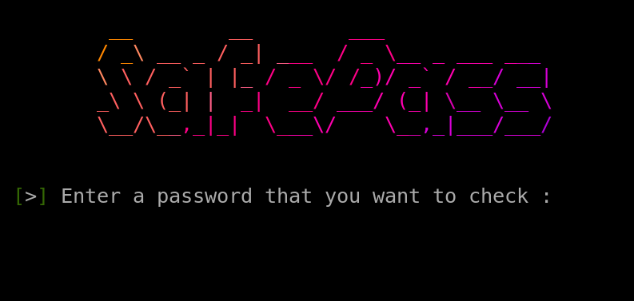

# SAFEPASS

- Tool made by GreyHat Organization and Declaration better known as ZeroByte!

- Safe password strength checker!

-----
## ABOUT

- `SafePass` is a simple and efficient shell script designed to evaluate the strength of passwords. By analyzing various criteria such as length, complexity, and common patterns, SafePass helps ensure that your passwords are strong and secure, safeguarding against potential security breaches.

## Key Features

- **Password Length Evaluation**: Checks if the password meets minimum length requirements.
- **Complexity Analysis**: Ensures that the password contains a mix of uppercase letters, lowercase letters, numbers, and special characters.
- **Common Pattern Detection**: Identifies and warns against the use of common passwords and patterns.
- **Real-time Feedback**: Provides instant feedback on the strength of the entered password.
- **Customizable Criteria**: Allows users to set their own requirements for password strength.
- **Saves Used Passwords in Text File**: Automaticlly makes 'txtauth' directory and file 'auth.txt' and stores used password in there.

## Use Cases

- **Personal Security**: Enhance personal account security by evaluating the strength of your passwords.
- **IT Administrators**: Ensure that employees are using strong passwords across the organization.
- **Developers**: Integrate SafePass into scripts or applications to enforce password policies.
- **Educators**: Teach the importance of password security by demonstrating real-time strength analysis.

## Getting Started

To start using `SafePass`, follow these simple steps:

1. **Clone the Repository**:
    ```
    git clone https://github.com/tkemza/safepass.git
    cd safepass
    ```

2. **Make the Script Executable**:
    ```
    chmod +x safepass.sh
    ```

3. **Run the Script**:
    ```
    ./safepass.sh
    ```

4. **Enter a Password**:
   - Follow the on-screen instructions to input a password, and receive real-time feedback on its strength.

### Example Usage

- Here's a quick example of how to use `SafePass`:
    ```
    ./safepass.sh
    ```

-----
# REQUIREMENTS

- Bash: SafePass is a shell script and requires a Unix-like environment with Bash installed.

- Optional: You can customize the script to enforce specific password policies by modifying the variables at the top of the script.\

-----
# CONTRIBUTING

- Contributions are welcome! Please feel free to submit a Pull Request or open an Issue for any bug reports, feature requests, or improvements.

-----
# PREVIEW



-----
# REPORT A BUG

 If you have any issue while running or using this tool, conctact me at:

    tkemaz.git@proton.me

 Any issues will be fixed in upcoming `version 2.0`

-----
# GPL-3.0 LICENSE

`GPL-3.0 LICENSE` (c) 2024 `tkemza`